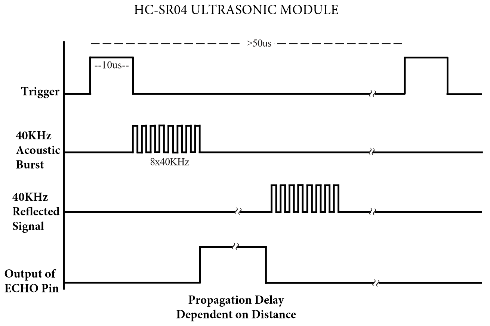

# Project Description
This project explores the operation of an ultrasonic distance sensor (HC-SR04) interfaced with the MSP432 microcontroller to create an ultrasonic alarm system. The system is configured to have the following behavior. On startup, the system is at idle. Once a button on the development board is pressed, a distance measurement is taken to calibrate the system. Now, in its armed state, the system will periodically poll the ultrasonic sensor and sound a buzzer when the distance measurement significantly changes from the calibration value.

# Implementation Details
The HC-SR04 module's datasheet provides the following waveform diagram to explain its interface.

While the diagram shows the trigger and ECHO signals on separate waveforms, they are actually combined into one pin on the module. This forced me to be more creative when designing the driver code. When distance needs to be measured, the MCU sets the GPIO direction of the signal pin to output and holds it high for 10us using a simple blocking `__delay_cycles()` call. It then sets the direction to input and enables a rising edge interrupt to capture the ECHO signal. When the interrupt fires, the ISR starts the timer to measure the ECHO pulse duration. It then sets its own edge direction to the falling edge to capture the end of the pulse. When the ISR fires again, it stops the timer to read the pulse duration and calculate the measured distance. 

The main loop of the program implements a simple state machine with three states: IDLE, ARMED, and TRIGGERED. In the IDLE state, the system waits for the button press to measure the calibration distance and transition to the ARMED state. In the ARMED state, it periodically triggers distance measurements and compares them to the calibration distance. If a significant change is detected, it transitions to the TRIGGERED state, where it activates the buzzer. The system can be reset back to the IDLE state by pressing the button again.

# Demonstration

[
