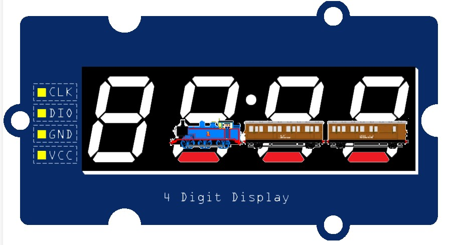

# Virtual Train: Project Description
This project explores I/O, complex software state machines, interrupts, and hardware timers. The goal of this project was to use a 4-digit 7-segment display module to display what looks like a train moving around the outside of the display. This is done using a state machine that lights up 3 segments at a time to represent the train, and moves the lit segments around the display to simulate movement. Below is a figure showing the display with the train in one of its positions. 

# Implementation Details
The movement of the train is controlled by two buttons. One button starts and stops the train, while the other button changes the direction of the train's movement. The buttons are polled in the main loop with the same debounce logic used in the [ButtonLED](../ButtonLED) project.

While the assignment defined these requirements, the design of the state machine and the implementation details were left up to me. I chose to implement two state machines. The control logic is handled by a 4-state state machine that manages the start/stop and direction of the train based on button presses. The main loop polls the button states and feeds them to the transition function. The second state machine is responsible for updating the display to show the train's current position based on the control state. It simply cycles through 12 positions in either direction when the train is running, and holds the current position when the train is stopped. The state transitions are driven by an interrupt attached to a hardware timer that fires once a second.

# Demonstration
Unfortunately, I had to delete the video demonstrating this project to free up space in my Google Drive. I wish I had it, because I remember it looking really cool.